<!-- ### Hi there 👋 -->

<!--
**flashsherlock/flashsherlock** is a ✨ _special_ ✨ repository because its `README.md` (this file) appears on your GitHub profile.

Here are some ideas to get you started:

- 🔭 I’m currently working on ...
- 🌱 I’m currently learning ...
- 👯 I’m looking to collaborate on ...
- 🤔 I’m looking for help with ...
- 💬 Ask me about ...
- 📫 How to reach me: ...
- 😄 Pronouns: ...
- ⚡ Fun fact: ...
-->

<!-- visit count -->
<!-- 
  
 -->
<!--  -->

<table>
  <tr>
    <td>
    
     
    
    </td>
    <td></td>
  </tr>
 </table>

<!--  -->
<!--  -->
<!--  -->